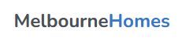
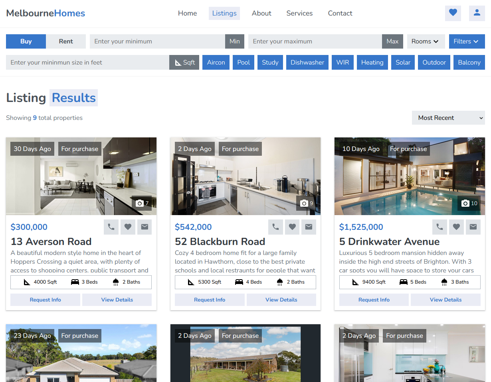
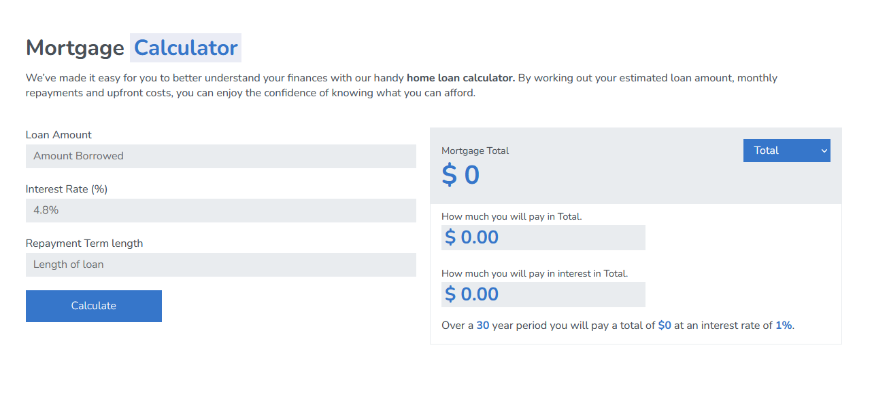
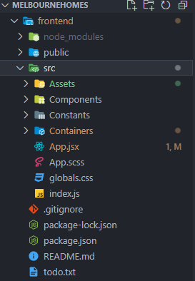

(Work in Progress) https://vocal-mochi-fa4cd9.netlify.app/ 

<br>
MelbourneHomes is a mock real estate website showcasing the beautiful homes available to buy or rent in all surrounding suburbs of Melbourne. In order to design and develop this website independently, languages utilised alongside React-Router, are JavaScript, React, Html, and CSS/SCSS. A functional web app was also developed to work within the website being the mortgage calculator.

<br>
<br>

[](https://skills.thijs.gg)

## How it works

MelbourneHomes allows users to search from a listing of homes that are stored on a local database. Houses can be sorted by Rent or Buying status, minimum and maximum purchase range, the minimum square foot size and rooms count eg.(3 Bedroom, 2 Bathroom). I also included a filters feature we users can toggle if they want their search to include features such as Aircons, Outdoor areas etc.


I've also added an in built mortgage calculator (in progress).The user will input their loan amount, interest rate and how long they have to pay off the loan. Then it will process those inputs and output the total pay including the interest rate overtime, how much interest will be paid alone and the mortgage total. These values can also be filtered be displayed as either annually, monthly, daily or weekly etc.

General styling and sections is included to show that it is a complete and marketable website that can applied to any business.

## What I learnt with this project

Undertaking this project made me realise how important it is to have a plan before attacking your project. Whilst doing the search listing I found, I had to constantly alter my JSX or create new components to suit my new method of doing something. Eg. When creating the filters select buttons I had initially decided to use the radio button element. But as I worked through creating the functionality I found it was alot easier to create a component that handled removing and adding values to an array on click. Example Below.

```javascript
const FeatureCheckBox = ({ text, feature, features, setFeatures }) => {
  const [toggleFeature, setToggleFeature] = useState(true);

  const addFeature = () => {
    console.log("Add Feature");
    // Add this to our Array
    if (toggleFeature === false) {
      setFeatures([...features, feature]);
    }
    console.log(features);
  };

  const removeFeature = () => {
    if (toggleFeature === true) {
      let index = features.findIndex((f) => {
        return f === feature;
      });
      if (index !== -1) {
        let newList = features;
        newList.splice(index, 1);
        setFeatures([...newList]);
      } else {
        return console.warn("Cannot find feature type index");
      }
    }
    console.log(features);
  };

  const toggleFeatureHandler = () => {
    if (toggleFeature) {
      setToggleFeature(false);
      removeFeature();
    } else {
      setToggleFeature(true);
      addFeature();
    }
  };

  return (
    <button
      className={`feature__check ${toggleFeature ? "active" : ""}`}
      onClick={toggleFeatureHandler}
    >
      {text}
    </button>
  );
};
```

## How I structured this project

What I did when structuring this project was separate my folders into Containers, Components, Constants and Assets. I watched a React Developer lecture online where he discussed a seperation of concerns. Where containers hold all the components, components are all re-usable, Assets are for images and miscellaneous files. While constants is for non-changing files such as data bases.
<br>



I did'nt want to use an API as I couldn't find a good API that was free and included alot of features for the homes that I could use. So I created a local database and set up my array of objects as such. So my listings page could refer to this array and display all the required data on search.

```javascript
export const houseData = [
  {
    // ==================== HOUSE 1 ===================
    address: "13 Averson Road",
    area: "Hoppers Crossing",
    price: 300000,
    sellType: "purchase",
    description:
      "A beautiful modern style home in the heart of Hoppers Crossing a quiet area, with plenty of access to shopping centers, public transport and schooling. For any time of family or single living.",
    listedTime: 30,
    beds: 3,
    baths: 2,
    garage: 2,
    living: 1,
    squareFeet: 4000,
    type: "house",

    filters: [
      { Aircon: false },
      { Pool: false },
      { Study: true },
      { Dishwasher: true },
      { WIR: true },
      { Heating: true },
      { Solar: true },
      { Outdoor: true },
      { Balcony: false },
    ],
    images: [
      images.house1_1,
      images.house1_2,
      images.house1_3,
      images.house1_4,
      images.house1_5,
      images.house1_6,
      images.house1_7,
    ],
    agent: agentsData.paul,
  },

```
